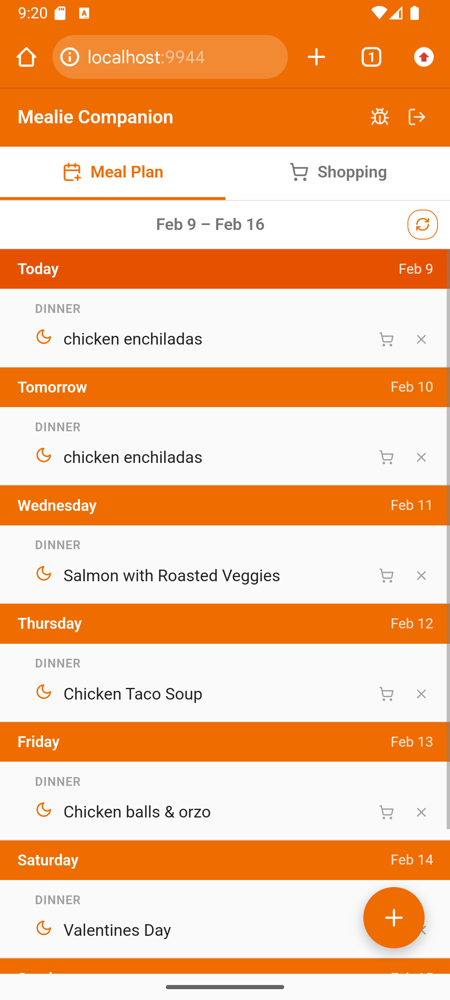
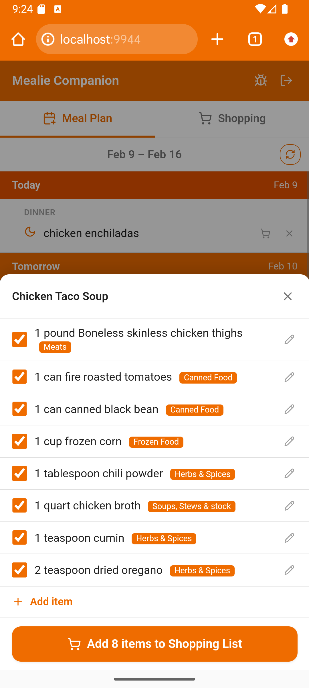
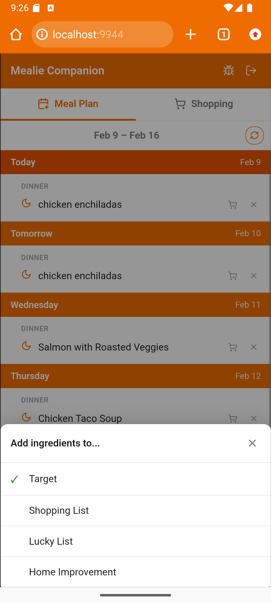
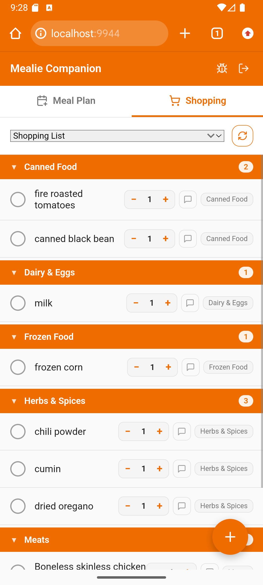
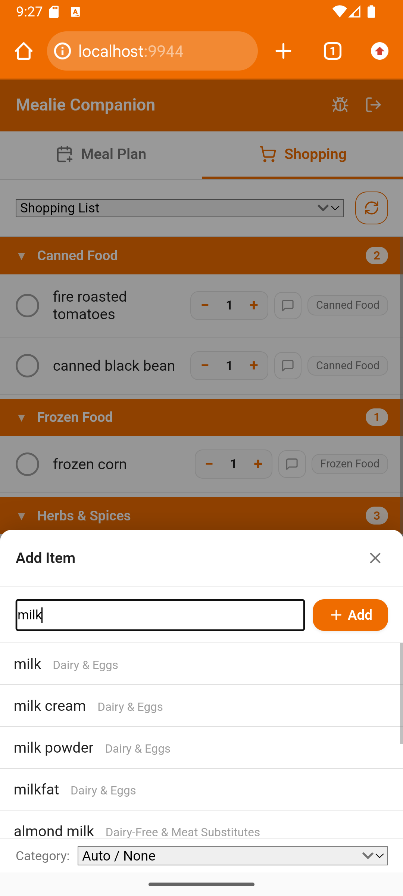
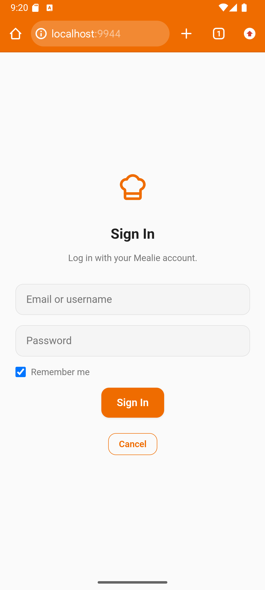

# Mealie Companion

Mealie Companion is a meal planning and shopping list focused UI to enhance [Mealie](https://mealie.io/). It's meant to allow you to quickly plan your weeks meals and create coherent shopping lists, while being able to leverage Mealie's advanced features.

**Key capabilities:**

1. **Meal Plan** - 8-day rolling view with quick add (paste a URL or search recipes), ingredient viewer, and one-tap add to shopping list
2. **Shopping List** - OurGroceries-style list with category grouping, autocomplete from Mealie's food database, and tap-to-check

## How It Works

The core workflow: plan your meals for the week, then build your shopping list directly from those recipes.

<table>
<tr>
<td width="50%" valign="top">

### Plan your week

See your upcoming meals at a glance. Add recipes by searching your collection or pasting a URL to import from the web. Each day shows meals grouped by type.

<p align="center">
  
</p>

</td>
<td width="50%" valign="top">

### Pick what you need from each recipe

Tap any recipe to see its full ingredient list. Every ingredient is linked to Mealie's food database with category labels. Uncheck anything you already have, or edit quantities before adding.

<p align="center">
  
</p>

</td>
</tr>
<tr>
<td width="50%" valign="top">

### Send ingredients to any shopping list

Choose which list to add to — keep a weekly grocery run separate from a warehouse store trip or a home improvement list.

<p align="center">
  
</p>

</td>
<td width="50%" valign="top">

### Shop with a clean, organized list

Items are grouped by category so you can work through the store aisle by aisle. Tap to check off items, adjust quantities, and add notes.

<p align="center">
  
</p>

</td>
</tr>
<tr>
<td width="50%" valign="top">

### Quickly add items on the fly

The add panel searches Mealie's food database as you type, so items get linked to the right category automatically. Or just type a name and add it directly.

<p align="center">
  
</p>

</td>
<td width="50%" valign="top">

### Sign in with your Mealie account

No API keys to manage — just log in with your existing Mealie credentials. Sessions auto-refresh and persist across PWA restarts.

<p align="center">
  
</p>

</td>
</tr>
</table>

## Architecture

Single-page Preact app using htm tagged templates (no build step), served by nginx:alpine. nginx proxies `/api/*` to Mealie to avoid CORS. Both containers share a Docker network.

## Setup

### Prerequisites

- Mealie running in Docker
- Docker Compose
- A Mealie user account (the app uses Mealie's login flow)

### Deploy

1. Clone this repo to your Docker host:

   ```bash
   git clone https://github.com/<your-user>/mealie-companion.git
   cd mealie-companion
   ```

2. Ensure your Mealie container is on a network called `mealie_default`. If your network has a different name, update `compose.yaml` accordingly.

3. If Mealie is not reachable at `mealie:9000` from within Docker, update the environment variables in `compose.yaml`:

   ```yaml
   environment:
     - MEALIE_HOST=your-mealie-hostname
     - MEALIE_PORT=9000
   ```

4. Start the container:

   ```bash
   docker compose up -d
   ```

5. Open `http://<your-host>:9944` in a browser.

6. Sign in with your Mealie username or email on first use.

## Features

### Authentication

Uses Mealie's native OAuth2 password login (`POST /api/auth/token`). Supports username or email. Session tokens auto-refresh every 20 minutes. With "Remember me" checked (default), the token is stored in `localStorage` so sessions persist across PWA restarts; unchecked uses `sessionStorage` for single-session use. No API keys to manage.

### Meal Plan

- **8-day rolling view**: shows today through 7 days ahead, with refresh button
- **Quick add**: tap the + button to open the add form; auto-detects URLs vs recipe names
- **Recipe search**: searches existing recipes with keyboard navigation (arrow keys + Enter)
- **URL import**: imports recipes from URLs via Mealie's scraper
- **Day-of-week date picker** (defaults to today, shows "Today", "Tomorrow", day names with dates) and **meal type selector** (defaults to dinner)
- **Ingredient viewer**: tap a recipe name to see its ingredients with checkboxes for selective adding; tap the pencil icon to edit quantity, unit (from server), and item name before adding
- **Add to shopping list**: tap the cart icon on any recipe to bulk-add all ingredients, or use the ingredient viewer to select/edit individual items first
- **Delete entries**: remove meals directly from the plan view

### Shopping List

- **List selector**: switch between your Mealie shopping lists
- **Category grouping**: items grouped by label with collapsible sections and orange headers
- **Add items**: tap the + button to open the add form with autocomplete from Mealie's food database (`/api/foods`); keyboard navigation (arrow keys + Enter) supported
- **Food linking**: all items are created as food entries so names are stored in `food.name` and the `note` field stays available for actual notes; selecting an existing food links it via `foodId` so the food's label is auto-assigned for category grouping
- **New items**: adding an item without a category automatically opens the edit modal so you can assign one
- **Quantity stepper**: tap +/− to adjust item quantity inline
- **Edit modal**: tap the pencil icon on any item to edit its note and reassign its category; search/filter labels by name; create new categories inline. Changes propagate back to Mealie's food database
- **Tap to check/uncheck**: items move between active and checked sections
- **Clear checked**: deletes all checked items with optimistic UI feedback
- **Pull to refresh**: on mobile, pull down to re-fetch

## Files

| File | Purpose |
|------|---------|
| `index.html` | App markup (HTML only) |
| `style.css` | All styles |
| `js/` | Application logic (Preact components in `components/`, shared hooks, signals, utils, api, auth) |
| `tests/` | Unit tests (Vitest) and E2E tests (Playwright) — see [`tests/README.md`](tests/README.md) |
| `manifest.json` | PWA manifest for home screen install |
| `sw.js` | Service worker for offline caching of static assets |
| `nginx.conf` | Reverse proxy config (envsubst template) |
| `compose.yaml` | Docker Compose deployment |
| `compose.test.yaml` | Standalone container for E2E tests (no Mealie network required) |
| `CLAUDE.md` | Testing policy and architecture notes for AI agents and developers |

## API Endpoints Used

- `POST /api/auth/token` - login (OAuth2 password flow)
- `GET /api/auth/refresh` - refresh session token
- `GET/POST /api/recipes` - search and create recipes
- `POST /api/recipes/create/url` - import from URL
- `GET /api/households/mealplans` - fetch meal plan entries by date range
- `POST /api/households/mealplans` - add to meal plan
- `DELETE /api/households/mealplans/{id}` - remove meal plan entry
- `GET /api/households/shopping/lists` - list shopping lists
- `GET /api/households/shopping/lists/{id}` - get list items
- `POST /api/households/shopping/items` - add item (with `foodId` or `note`)
- `PUT /api/households/shopping/items/{id}` - check/uncheck
- `DELETE /api/households/shopping/items/{id}` - remove item
- `GET /api/foods?search=` - autocomplete food search
- `GET /api/recipes/{slug}` - get recipe details (ingredients)
- `POST /api/households/shopping/lists/{id}/recipe/{recipeId}` - add recipe ingredients to list
- `GET /api/units` - list available units (for ingredient editing)
- `GET/PUT /api/foods/{id}` - read/update food (for label propagation)
- `GET/POST /api/groups/labels` - list and create category labels
